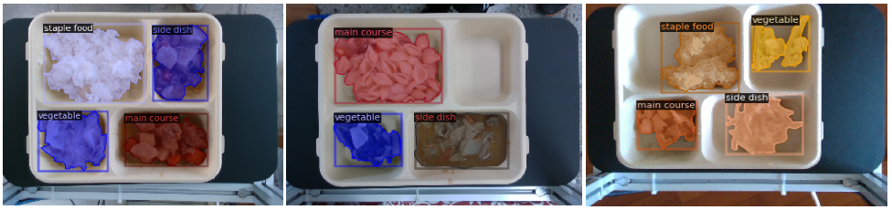
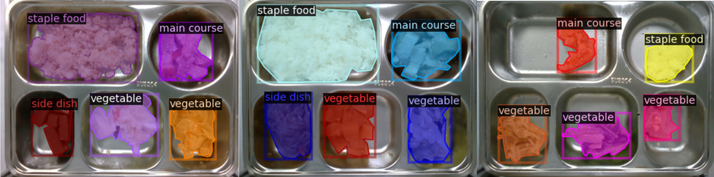

# Food-Instance-Segmentation
## NCKU "Introduction to neural network" - (**Final Project**)


### Categories:
1. staple food
2. main course
3. side dish
4. vegetable

### Dataset Description:
|  | staple food | main course | side dish | vegetable | total |
| :--: | :--: | :--: | :--: | :--: | :--:|
| instances | 1174 | 1022 | 965 | 1268 | 4429 |

### Label Tool: 
1. Detection task label tool: [LabelImg](https://github.com/HumanSignal/labelImg)
2. Segmetation task label tool: [Labelme](https://github.com/wkentaro/labelme)

### Dependencies
* pytorch-21.06-py3:latest

* Download the pretrained weight: [Download link](https://dl.fbaipublicfiles.com/detectron2/COCO-Detection/faster_rcnn_R_50_C4_3x/137849393/model_final_f97cb7.pkl)
   ```shell
      wget -q https://dl.fbaipublicfiles.com/detectron2/COCO-Detection/faster_rcnn_R_50_C4_3x/137849393/model_final_f97cb7.pkl 
* Install others related library and dependencies:
   ```shell
      sudo apt-get update
      sudo apt-get install ffmpeg libsm6 libxext6  -y
   ```
#### show_images.py
```shell
python show_images.py
```

### Experiment Results

